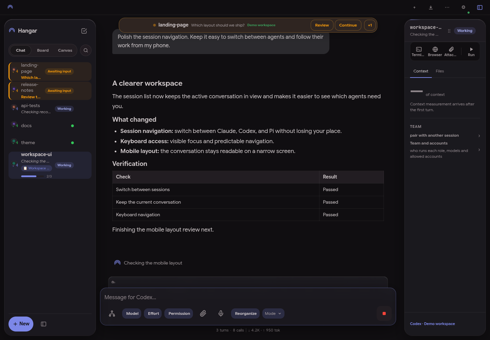
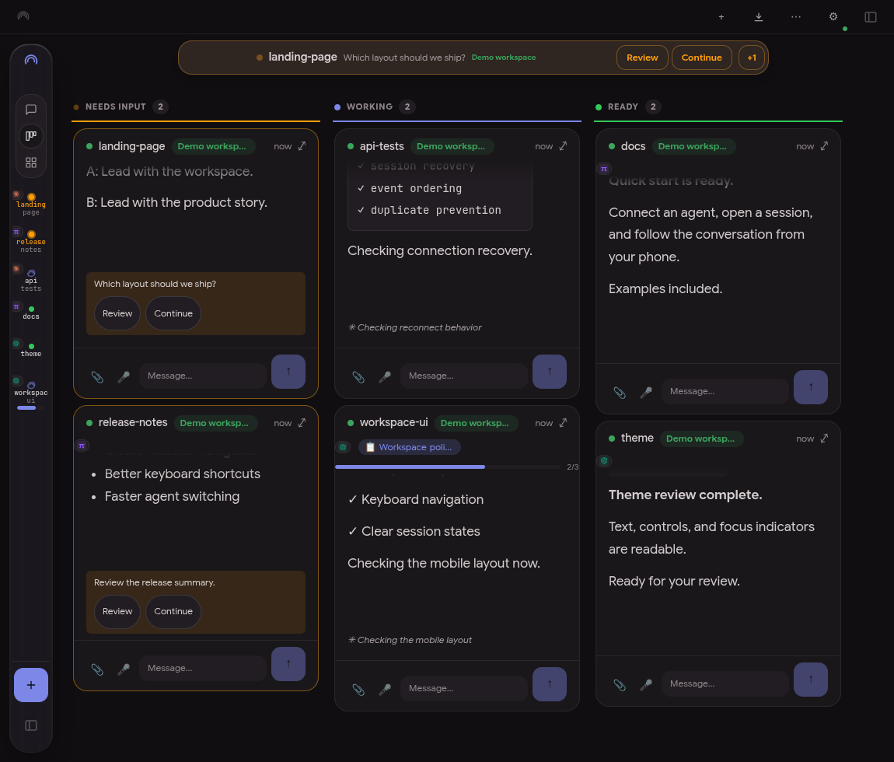

# Jefferson Felizardo

**Software development · AI agent tooling · Linux & automation**

I build tools to solve problems I run into every day.

This is where I share my personal projects: keeping track of coding agents, automating repetitive tasks, and making my development environment work the way I want.

[LinkedIn](https://www.linkedin.com/in/jefferson-felizardo-1537b690/) · [Email](mailto:jeffer1312@gmail.com) · [Instagram](https://instagram.com/jeffersonfelizardo)

## Featured: Hangar

A self-hosted panel to monitor and interact with **Claude Code, Codex, Kimi, and Pi** sessions from your desktop or phone.

I built it to follow my agents' work and respond when they need me, even away from the terminal. It brings conversations, sessions, plans, and usage estimates into one place.

**Board view — multiple agents at a glance**

[Explore the project →](https://github.com/jeffer1312/hangar) · [Watch the demo](https://github.com/jeffer1312/hangar/releases/download/demos/hangar-demo-en.mp4)

## Technologies I work with

| Area | Technologies |
| --- | --- |
| Frontend | TypeScript, React, Next.js, Svelte |
| Backend & integrations | Node.js, C# / .NET, Python, Delphi |
| Data | SQL, PostgreSQL, Redis |
| Environment | Linux, Docker, Git, Hyprland |

## Other projects

- [pi-claude-bridge](https://github.com/jeffer1312/pi-claude-bridge) — Claude Code-inspired themes and visual extensions for Pi.
- [OBS Controller](https://github.com/jeffer1312/OBS-Controller-React) — control OBS Studio with React and Node.js.

---

I also enjoy tinkering with **Linux, Hyprland, terminal tools, and automation**.
